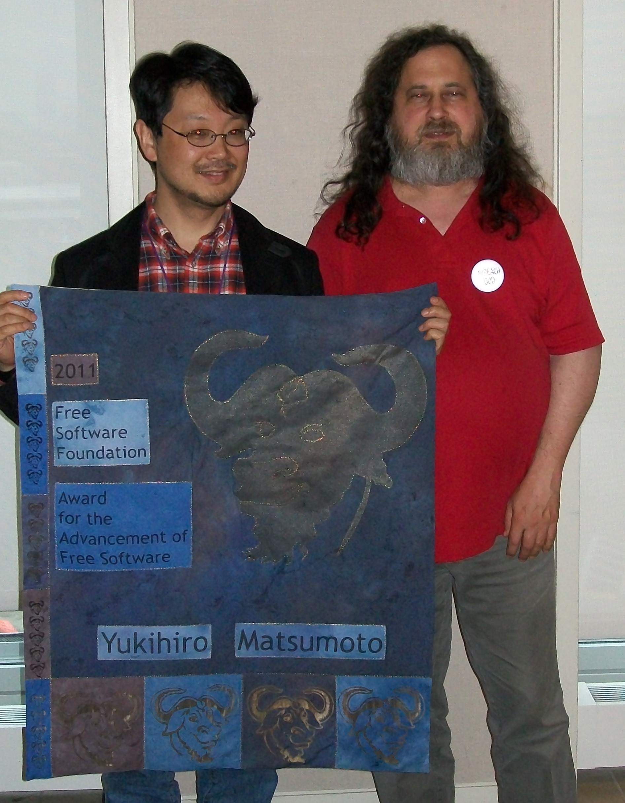

# Ruby & Ruby on Rails

!SLIDE

# Ruby & Ruby on Rails

## Лисовский Влад, Lakehouse

### lisovskyvlad@gmail.com

!SLIDE ruby_bg bottom-right

}}} images/ruby.png

!SLIDE left

# Краткая история Ruby

* Разработан японцем Юкихиро Мацумото;
* Вышел в свет в 1995 году;
* Что хотел создатель:
  * Более мощныи язык, чем Perl; Более ООП язык, чем Python.

